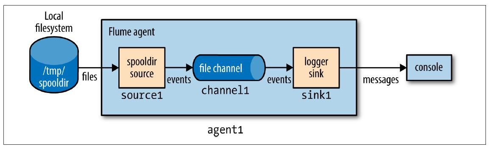
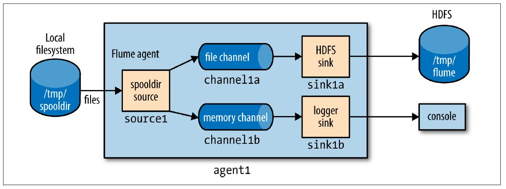
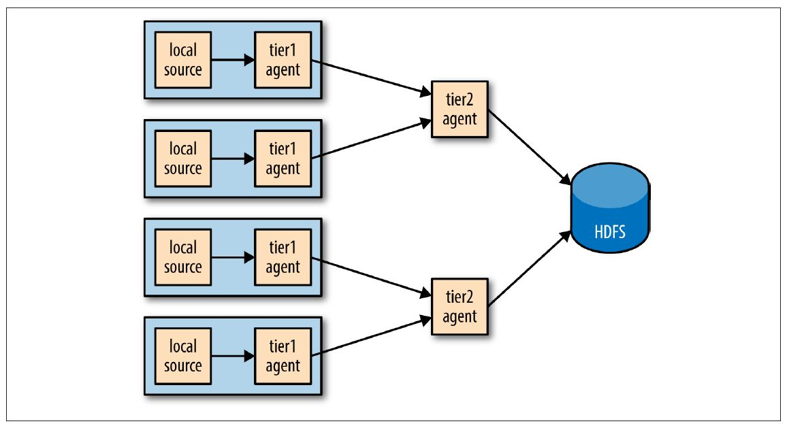
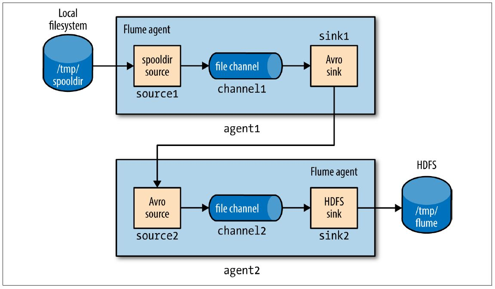
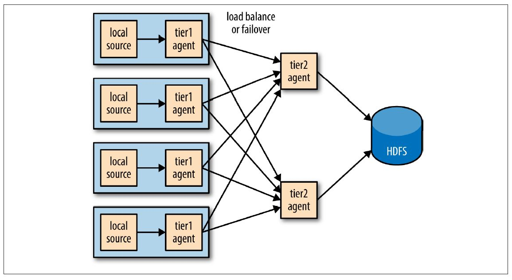
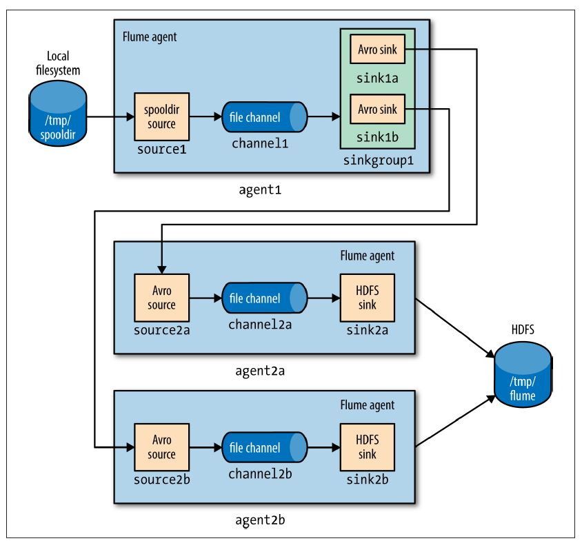

Hadoop被设计用来处理很大量的数据。通常认为这些数据已经存储在HDFS，或者可以大量复制。然而，很多系统不满足这些假设。这些系统产生大量的数据流需要使用Hadoop结构化、存储、分析，Apache Flume就是被设计用来做这些工作的。

Flume被设计用来将大量数据驱动的数据传入Hadoop，典型应用场景是使用Flume收集银行web服务器的日志，然后将这些日志聚合到新的汇总文件并传入HDFS处理。通常的传输目的地(在Flume中的sink)是HDFS。然而，Flume足够灵活也能够写入到其他系统，例如HBase和Solr。

为了使用Flume，需要运行Flume *agent*端（下文翻译为客户端），这是一个Java的常驻进程，运行*sources*和*sinks*，连接*channels*。Flume中的*sources*产生*events*（以下翻译为事件）并将它们传送到*channel*，*channel*会存储这些*events*直到它们被送到*sink*中。可以认为*source-channel-sink*结合是一个基本的Flume组成部分。

Flume的安装由收集分布式拓扑结构中运行的客户端组成。处于系统边缘的客户端（例如web服务器）收集数据，转发到负责汇总的客户端，最后存储到最终目的地。指定的*sources*和*sinks*客户端被配置用来运行收集工作，实际上使用Flume就是将这些配置放到一起的实践。本文将描述如何搭建Flume拓扑作为Hadoop生态圈的一部分

# 安装Flume

从[官网](http://flume.apache.org/download.html)选择一个稳定版本的可执行压缩包下载Flume，在合适的位置解压tar包：
```
% tar xzf apache-flume-x.y.z-bin.tar.gz
```
配置环境变量：
```
% export FLUME_HOME=~/sw/apache-flume-x.y.z-bin
% export PATH=$PATH:$FLUME_HOME/bin
```
Flume客户端可以使用`flume-ng`命令启动，如下所述。

# 示例

为了显示Flume如何工作，让我们从以下设置开始：

1. 追踪本地文件目录的新文本文档
1. 发送文件新增的每一行到数据流

现在手动增加文件，但很容易假设一个进程（例如web服务器）不断产生新文件需要被Flume摄取。在生产环境中，不仅仅是记录文件，还需要通过后来的处理将这些内容写入到HDFS——下文会详述。

在本例中，Flume客户端运行一个单独的*source-channel-sink*，通过一个Java properties文件配置。配置文件决定了使用*sources*、*sinks*和*channels*的类型，它们是互相关联的。如下例所示：
```
# Flume configuration using a spooling directory source and a logger sink
agent1.sources = source1
agent1.sinks = sink1
agent1.channels = channel1
agent1.sources.source1.channels = channel1
agent1.sinks.sink1.channel = channel1
agent1.sources.source1.type = spooldir
agent1.sources.source1.spoolDir = /tmp/spooldir
agent1.sinks.sink1.type = logger
agent1.channels.channel1.type = file
```
客户端的层次结构属性名在最顶端。在本例中，只有一个叫做**agent1**的客户端。客户端不同组件的名称在下一层级设置，例如*agent1.sources*描述了在**agent1**上运行的*sources*（本例是一个单独的*sources*，**source1**）。类似地，**agent1**也有*sink*（**sink1**）和*channel*（**channel1**）。

每一个组件的属性在下一层次结构设置，属性的配置根据属性不同而可用。在本例中**agent1.sources.source1.type**被设置为**spooldir**，这是一个spooling directory source，监控新文件的spooling目录。spooling directory source定义了**spoolDir**属性，完整的键值是agent1.sources.source1.spoolDir。source的channel由agent1.sources.source1.channels设置。

*sink*是一个**logger**，记录事件到输出，它必须和channel（通过**agent1.sinks.sink1.channel property**设置）连接。channel是一个**file**channel，意味着在channel中的事件会永久保存到磁盘中，整个系统的说明如下图所示



在运行例子之前，我们需要在本地文件系统上新建spooling目录：
```
mkdir /tmp/spooldir
```
使用`flume-ng`命令启动Flume客户端：
```
% flume-ng agent \
--conf-file spool-to-logger.properties \
--name agent1 \
--conf $FLUME_HOME/conf \
-Dflume.root.logger=INFO,console
```
如上例中Flume的属性文件需要**--conf-file**指定，客户端的名字必须通过**--name**指定（因Flume可以设置多个客户端，需要指定哪个运行）。**--conf**参数告知Flume寻找它的配置文件，与环境变量类似。

在一个新的终端，在spooling目录内新建一个文件，假设这个文件不可改变。为了阻止source读取并改写文件，将内容写入到隐藏文件中。再将文件重命名使source可以读取到：
```
% echo "Hello Flume" > /tmp/spooldir/.file1.txt
% mv /tmp/spooldir/.file1.txt /tmp/spooldir/file1.txt
```
客户端终端的后台，可以看到Flume已经探测到并处理该文件
```
Preparing to move file /tmp/spooldir/file1.txt to
/tmp/spooldir/file1.txt.COMPLETED
Event: { headers:{} body: 48 65 6C 6C 6F 20 46 6C 75 6D 65 Hello Flume }
```
spooling目录将文件按行切割来摄取，每行均产生Flume事件。事件有一个可选的头部和二进制的正文，文档的编写格式为UTF-8。正文部分被sink用十六进制和字符串的形式记录。上文放到spooling目录下的文件只有一行，故只有一个事件在本例中被记录。可以看到文件被soucre重命名为*file1.txt.COMPLETED*，意味着Flume已经处理过该文件，且不会再处理

# 事务和可靠性

Flume将*source*传送到*channel*中，从*channel*传送到*sink*的过程中使用分享的事务。上文所述的例子中，spooling目录的source文件中的每一行产生了一个事件。只有事务成功提交之后，source才会将文件标记为完成。

类似的，事务也被用在*channel*到*sink*的传输。如果某些原因导致事件不能被记录，事务会回滚，事件会保持在*channel*中，以用于之后的传输。

上文提到的*channel*是一个*file channel*，拥有持久化存储的属性：一旦事件被写入到*channel*中，它不会丢失，即使客户端重启。（Flume也提供一个*memory channel*，因为事件存储在内存中，它没有这种特性持久化存储特性，这种*channel*的事件在客户端重启后会丢失。根据不同的应用场景，这也许可接受。相比之下，*memory channel*比*file channel*有更高的吞吐量。

整体效果上，每个*source*产生的事件都会到达*sink*。注意，每个事件会到达*sink* *至少一次*，这表明，有重复的可能。副本可能由*sources*或*sinks*产生，例如，在客户端重启后，*spooling directory*的*source*会重新发送一个未完成的文件，尽管它们部分已经在重启之前提交到*channel*。重启之后，*logger sink*会重新记录未被提交事务的任何事件。


*至少一次*(*at-least-once*)看起来是限制, 但实际上是可以接受的权衡。*完全一次*需要一个两步的提交协议，消耗更多资源。这个选择是区分Flume（一个高容量并行事件接收系统）和其他传统的企业消息系统（*完全一次*）。*at-least-once*产生的重复事件可以在处理的管道流中删除。通常这需要MapReduce或者Hive编写特定的应用程序删除。

## Batching（定量？）

为了提高效率，Flume尽可能尝试批量处理事件的事务，而不是一个一个处理。批量处理提高了file channel的性能，因为每个事务写入到本地磁盘并且调用**fsync**

批量处理的大小由组件决定，并在许多情况下可配置，例如，*spooling*目录会100行批量读取文件（可以通过修改batchSize属性设置）。类似的，*Avro sink*在将事件通过RPC发送之前试图读取100个来自*channel*的事件，如果有更少的事件也不会影响。


# The HDFS Sink

Flume的一个优势在于传输大量数据到Hadoop存储，来看下如何配置Flume客户端将事件传到HDFS sink。下面的配置示例将之前的例子更改为使用HDFS sink。只需要指定sink类型为**hdfs**和**hdfs.path**（指定存放路径，通常为**fs.defaultFS**）两个属性。也已经指定有意义的文件前缀和后缀，表明Flume将事件用文本格式写入到文件中。

```
#Flume configuration using a spooling directory source and an HDFS
sink
agent1.sources = source1
agent1.sinks = sink1
agent1.channels = channel1
agent1.sources.source1.channels = channel1
agent1.sinks.sink1.channel = channel1
agent1.sources.source1.type = spooldir
agent1.sources.source1.spoolDir = /tmp/spooldir
agent1.sinks.sink1.type = hdfs
agent1.sinks.sink1.hdfs.path = /tmp/flume
agent1.sinks.sink1.hdfs.filePrefix = events
agent1.sinks.sink1.hdfs.fileSuffix = .log
agent1.sinks.sink1.hdfs.inUsePrefix = _
agent1.sinks.sink1.hdfs.fileType = DataStream
agent1.channels.channel1.type = file
```
重启客户端，使用*spool-to-hdfs.properties*配置，在本地目录下新建一个新文件：
```
% echo -e "Hello\nAgain" > /tmp/spooldir/.file2.txt
% mv /tmp/spooldir/.file2.txt /tmp/spooldir/file2.txt
```

现在事件被传输到HDFS并写入到文件中。处理中的文件有一个*.tmp*的后缀在名字中以表明未被处理完成。在此例中，已经设置**hdfs.inUsePrefix**属性为_（下划线，默认为空），这样在处理的文件会它文件名中加入 _ 前缀。一直持续到MapReduce忽略以下划线开头的文件。因此，一个典型的文件名为*_events.1399295780136.log.tmp;*，数字为HDFS sink产生的时间戳。

文件被HDFS sink一直打开，直到指定时间（默认30秒，由*hdfs.rollInterval*属性决定）、指定大小（默认1024字节，由*hdfs.rollSize*决定）或指定事件数目（默认10，由*hdfs.rollCount*决定）。如果任一条件满足，文件关闭，前缀和后缀被删除。新的事件写入到一个新文件（有使用中的前缀和后缀直到处理完）。

30秒之后，确认文件回滚完，可以看下它的内容
```
% hadoop fs -cat /tmp/flume/events.1399295780136.log
Hello
Again
```
HDFS sink写入到文件的用户与运行Flume客户端的用户相同，除非指定了**hdfs.proxyUser**，写入文件由该属性决定


## 分区和拦截器

大型数集通常需要分区，如果只有一个子集的需要查询，可以限制在特定的分区中进行处理。对于Flume事件数据，通常按时间分区。一个进程可以定期运行，将完成的分区转换（例如删除重复事件）。

通过设置**hdfs.path**包括时间格式，如下所示，可以改变数据在分区中的存储
```
agent1.sinks.sink1.hdfs.path = /tmp/flume/year=%Y/month=%m/day=%d
```
这我们选择按日分区，但其它级别的颗粒度也可行，需要设置目录存储的schemes。完成格式参考[Flume User Guide](http://flume.apache.org/FlumeUserGuide.html)

Flume的事件写入分区由事件头部的**timestamp**决定。默认情况下，事件没有头部，但可以使用一个*interceptor*填加。*Interceptor*是可以在流中修改或者删除事件的组件，它们附加到sources，在事件被放到sources之前运行。以下的配置增加了一个时间拦截器到**source1**，增加了一个**timestamp**头到每个由source产生的事件中
```
agent1.sources.source1.interceptors = interceptor1
agent1.sources.source1.interceptors.interceptor1.type = timestamp
```
使用时间戳interceptor保证了时间戳反应事件创建的时间。对一些应用来说，当事件写入到HDFS中使用时间戳是充足的，尽管当Flume客户端是多个tiers通常创建时间和写入时间不同，尤其是客户端未运行时的事件。对于这种情况，HDFS sink有一个**hdfs.useLocalTimeStamp**设置，会使用一个运行HDFS sink的Flume客户端生成

## 文件格式

通常来讲，使用二进制格式来存储数据是一个更好的主意，因为它比文本形式占用更少的空间。对HDFS sink来说，文件存储的格式由*hdfs.fileType*和其它的一些参数共同决定

*hdfs.fileType*的默认值为*SequenceFile*，将事件写入到sequence file中,*LongWritable*包括事件的时间(如果*timestamp*头部未设置，则包括当前时间戳），*BytesWritable*值包括事件主体。将*hdfs.writeFormat*设置为*Text*后，可以用Text Writable代替BytesWritable写入到sequence file中

# Fan Out

*Fan out*是将事件从一个source传输到多个channels，使它们能达到多个sinks的术语。例如下述配置，可以将事件传送到HDFS sink（通过channel1a传到sink1a）和一个日志sink（channel1b传到sink1b）
```
agent1.sources = source1
agent1.sinks = sink1a sink1b
agent1.channels = channel1a channel1b
agent1.sources.source1.channels = channel1a channel1b
agent1.sinks.sink1a.channel = channel1a
agent1.sinks.sink1b.channel = channel1b
agent1.sources.source1.type = spooldir
agent1.sources.source1.spoolDir = /tmp/spooldir
agent1.sinks.sink1a.type = hdfs
agent1.sinks.sink1a.hdfs.path = /tmp/flume
agent1.sinks.sink1a.hdfs.filePrefix = events
agent1.sinks.sink1a.hdfs.fileSuffix = .log
agent1.sinks.sink1a.hdfs.fileType = DataStream
agent1.sinks.sink1b.type = logger
agent1.channels.channel1a.type = file
agent1.channels.channel1b.type = memory
```
关键改变在于source被配置成传输到多个channels，通过将**agent1.sources.source1.channels**设置成一个channel names之间用空格分隔的列表 ，本例中为channel1a和channel1b。现在，传到logger sink（channel1b）的channel是一个memory channel，因为我们仅为了做测试传输日志事件，并不关心客户端重启时丢失的事件。同样和前述例子相同，每个channel配置一个sink，如下图所示：



## Delivery Guarantees（传输保证）
Flume从spooling directory source到每一个channel使用分离的事务传送定量的事件。在本例中，通过channel传到HDFS sink使用一个事务，另一个事务传送相同的事件量到logger sink的channel。如果这两个事务有任何一个失败了（例如一个channel已满），则事件将从sources中移出，过段时间再重试。

在本例中，因为我们不在乎是否有事件没有传送到logger sink，所以可以将它的channel设置为一个*optional*的channel，这样如果和它相关的事务失败了，不会导致事件留在source并重试。（注意如果客户端在两个事务均提交完成之前宕机，有关的事件会在客户端重启之后重新传输，即使未提交的事务channel被标记为*optional*）为了达到这个目的，设置source中的*selector.optional*属性，值为用空格分割的channels列表
```
agent1.sources.source1.selector.optional = channel1b
```

> # near-real-time indexing
给事件加索引是实践中使用fan out的一个很好示例。一个单独的事件source被发送到HDFS sink（主要的事件仓库，故使用了一个必需的channel）和一个Solr（或者Elasticesarch）sink，建立一个搜索索引（使用可选的channel）。
MorphlineSolrSink将fileds从Flume事件提取出来将传输到一个Solr文档（使用一个Morphline配置文件），然后载入到一个实时Solr搜索服务中。这个处理过程称作*near real time*，因为只需要几秒就可以将数据处理并展示到搜索结果中。

## 复制和多路选择器
在通常的fan-our流中，事件被复制到所有的channels——但是更多选择是更可取的，以至一些事件被发送到某个channel，其它事件被发送到其它channel。这可以通过设置source的*multiplexing*选择器实现，也能定义路由规则引导指定的事件头部到channels中，参见[官方文档](http://flume.apache.org/FlumeUserGuide.html)

# 分布式：Agent Tiers
如果设置大规模Flume客户端？如果有一个客户端在每一个节点产生新的原始数据，到目前为止的配置，任何时刻每个文件都从一个节点持续性写入到HDFS。如果能够将事件从一组节点聚合到一个文件会更好，这样会产生更少更大的文件（伴随着减少HDFS的压力，并且更有效的处理MapReduce）。同样，如果有必要，文件可以更频繁的回滚因为被更大数量的节点提前数据，导致了从一个事件的建立到可提供分析之间的时间间隔。

将Flume客户端事件聚合是由Flume客户端的*tiers*实现的。第一个*tier*收集原始sources（例如web服务器），将它们发送到第二个*tier*的更小的客户端集合，第二*tier*在写入HDFS之前将第一个*tier*的事件聚合。如果source节点足够多，则需要更多的*tiers*



*Tiers*使用一个特殊的sink将事件通过网络发送，一个对应的*source*接收事件。*Avro sink*通过*Avro RPC*将事件发送到运行在另一个Flume客户端的*Avro source*。也有一个*Thrift sink*通过*Thrift RPC*与一个*Thrift source*协同做同样的事。

> 不要被名字困扰：*Avro sinks*和*source*不能够写入（或读取）*Avro files*。它们只用来在客户端的*tiers*分发事件，并且为了这样做它们使用*Avro RPC*沟通（注意此处用词）。如果需要将事件写入到*Avro files*，使用HDFS sink

下列展示了two-tier Flume配置。该配置文件中有两个客户端，分别叫agent1和agent2。一个类型为agent1的客户端运行在第一个tier，有一个*spooldir*源和一个*Avro sink*通过一个文件channel连接。agent2运行在第二个tier，有一个*Avro source*监听**agent1's**的*Avro sink*发送事件的端口。**agent2**的sink使用相同的HDFS sink配置，如上例（The HDFS Sink章节例子）所示

注意在同一台机器上有两个file channels运行，它们被配置指向不同的数据和检查目录（默认在用户的家目录下）。因此，它们不试图将各自的文件写入到对方中。

```
####A two-tier Flume configuration using a spooling directory source and an
HDFS sink
# First-tier agent
agent1.sources = source1
agent1.sinks = sink1
agent1.channels = channel1
agent1.sources.source1.channels = channel1
agent1.sinks.sink1.channel = channel1
agent1.sources.source1.type = spooldir
agent1.sources.source1.spoolDir = /tmp/spooldir
agent1.sinks.sink1.type = avro
agent1.sinks.sink1.hostname = localhost
agent1.sinks.sink1.port = 10000
agent1.channels.channel1.type = file
agent1.channels.channel1.checkpointDir=/tmp/agent1/file-channel/checkpoint
agent1.channels.channel1.dataDirs=/tmp/agent1/file-channel/data
# Second-tier agent
agent2.sources = source2
agent2.sinks = sink2
agent2.channels = channel2
agent2.sources.source2.channels = channel2
agent2.sinks.sink2.channel = channel2
agent2.sources.source2.type = avro
agent2.sources.source2.bind = localhost
agent2.sources.source2.port = 10000
agent2.sinks.sink2.type = hdfs
agent2.sinks.sink2.hdfs.path = /tmp/flume
agent2.sinks.sink2.hdfs.filePrefix = events
agent2.sinks.sink2.hdfs.fileSuffix = .log
agent2.sinks.sink2.hdfs.fileType = DataStream
agent2.channels.channel2.type = file
agent2.channels.channel2.checkpointDir=/tmp/agent2/file-channel/checkpoint
agent2.channels.channel2.dataDirs=/tmp/agent2/file-channel/data
```
如下图所示：



每一个客户客户端独立运行，使用相同的**--conf-file**配置文件，但是不同的客户端**--name**变量：
```
% flume-ng agent --conf-file spool-to-hdfs-tiered.properties --name agent1 ...
```
和
```
% flume-ng agent --conf-file spool-to-hdfs-tiered.properties --name agent2 ...
```

## 传输保证
Flume使用事务保证每一份定量的事件从一个source传送到一个channel，再从channel传到sink。在上文中的*Avro sink-source*连接中，事件保证事件从一个客户端传到下一个。

通过Avro sink读取**agent1**的文件*channel*中定量的事件被包括在一整个事务中。只有在Avro sink（同步）确认写到Avro source的RPC成功结束，整个事务才会被提交。

# Sink Groups

一个sink组将多个sinks看作一个整体，如下图，用负载均衡做故障转移。如果第二tier不可用，事件会被发送到另一个第二tier，并可不间断的传送到HDFS



为了配置一个sink组，客户端**sinkgroups**属性设置sink组的名字，然后sink组列出组内所有的sink，包括sink处理的类型，这决定了处理sink的方式。下例展示两个Avro端点的负载均衡配置
```
###A Flume configuration for load balancing between two Avro endpoints
using a sink group
agent1.sources = source1
agent1.sinks = sink1a sink1b
agent1.sinkgroups = sinkgroup1
agent1.channels = channel1
agent1.sources.source1.channels = channel1
agent1.sinks.sink1a.channel = channel1
agent1.sinks.sink1b.channel = channel1
agent1.sinkgroups.sinkgroup1.sinks = sink1a sink1b
agent1.sinkgroups.sinkgroup1.processor.type = load_balance
agent1.sinkgroups.sinkgroup1.processor.backoff = true
agent1.sources.source1.type = spooldir
agent1.sources.source1.spoolDir = /tmp/spooldir
agent1.sinks.sink1a.type = avro
agent1.sinks.sink1a.hostname = localhost
agent1.sinks.sink1a.port = 10000
agent1.sinks.sink1b.type = avro
agent1.sinks.sink1b.hostname = localhost
agent1.sinks.sink1b.port = 10001
agent1.channels.channel1.type = file

```
此例定义了两个Avro sinks，**sink1a**和**sink1b**，区别在于连接的Avro端点不同（因为在localhost中运行所有例子，故只有端口不同，在一个分布式系统中，应该host不同，端口相同）。定义了**sinkgroup1**，把它sink连接到**sink1a**和**sink1b**

处理类型被设置为**load_balance**，会在组内的sink尝试传送事件流，使用一个轮询选择机制（可以通过改变**processor.selector**属性来改）。如果一个sink不可用，则会尝试下一个；如果均不可用，事件不会从channel移除，就像单独sink的情况。默认情况下，sink不可用不会被sink处理器记录，所以失败的sink会重新尝试已经在传送的定量的事件。这样是效率低下的，所以设置**processor.backoff**属性改这种行为，使得失败的sink在一个指数增长地中断时间（最大值30秒，由**processor.selector.maxTimeOut**决定）内被列入黑名单

第二tier客户端其中的一个**agent2a**配置如下所示：
```
agent2a.sources = source2a
agent2a.sinks = sink2a
agent2a.channels = channel2a
agent2a.sources.source2a.channels = channel2a
agent2a.sinks.sink2a.channel = channel2a
agent2a.sources.source2a.type = avro
agent2a.sources.source2a.bind = localhost
agent2a.sources.source2a.port = 10000
agent2a.sinks.sink2a.type = hdfs
agent2a.sinks.sink2a.hdfs.path = /tmp/flume
agent2a.sinks.sink2a.hdfs.filePrefix = events-a
agent2a.sinks.sink2a.hdfs.fileSuffix = .log
agent2a.sinks.sink2a.hdfs.fileType = DataStream
agent2a.channels.channel2a.type = file
```
**agent2b**的配置文件是相同的，除了Avro source的端口（因为所有例子运行在localhost）和HDFS sink创建的文件前缀。这个文件前缀是确保由second-tier客户端同时创建的HDFS文件不会发生冲突。

在更多情况下，客户端运行在不同的服务器上，hostname可以用来独立区分文件名字通过配置一个host intercepter，包手**%{host}**转义序列在文件路径或前缀中：
```
agent2.sinks.sink2.hdfs.filePrefix = events-%{host}
```
如下图所示：



# Flumey应用整合

一个Avro source是一个接收Flume事件的RPC端点，能够将一个RPC客户端发送事件到端点，嵌入到任何想要将事件介绍到Flume的应用。

*Flume SDK*是一个模块，提供了Java RpcClient类，用作发送事件对象到一个Avro端点（一个Avro source在Flume客户端上运行，通常在另一个tier）。客户端可以配置为两个端点之间故障处理或负载均衡，Thrift端点（Thrift sources）同样支持。

Flume *embedded agent*提供相似的功能：一个运行在Java应用上的缩减版的Flume客户端。有一个独立的特殊source，通过调用一个叫做*EmbeddedAgent*对象的方法发送Flume **Event**对象；只有Avro sinks支持该特性，但其他sinks可以配置为故障转移或者负载均衡。

SDK和嵌入客户端更多信息参见官方开发者[文档](http://flume.apache.org/FlumeDeveloperGuide.html)

# 组件目录

上文只使用到少量的Flume组件，它还有更多组件简述如下。参考官方[文档](http://flume.apache.org/FlumeUserGuide.html)获得更多信息。

类别  | 组件| 备注
---|---|---  
Source | Avro | Listens on a port for events sent over Avro RPC by an Avro sink or the Flume SDK.  
Source | Exec | Runs a Unix command (e.g., tail -F/path/to/file) and converts lines read from standard output into events. Note that this source cannot guarantee delivery of events to the channel; see the spooling directory source or the Flume SDK for better alternatives.
Source | HTTP| Listens on a port and converts HTTP requests into events using a pluggable handler (e.g., a JSON handler or binary blob handler).
Source | JMS | Reads messages from a JMS queue or topic and converts them into events.
Source | Netcat | Listens on a port and converts each line of text into an event.
Source | Sequence generator | Generates events from an incrementing counter. Useful for testing.
Source | Spooling directory | Reads lines from files placed in a spooling directory and converts them into events.
Source | Syslog | Reads lines from syslog and converts them into events.
Source | Thrift | Listens on a port for events sent over Thrift RPC by a Thrift sink or the Flume SDK.
Source | Twitter | Connects to Twitter’s streaming API (1% of the firehose) and converts tweets into events.
Sink | Avro | Sends events over Avro RPC to an Avro source.
Sink | Elasticsearch| Writes events to an Elasticsearch cluster using the Logstash format.
Sink | File roll | Writes events to the local filesystem.
Sink | HBase | Writes events to HBase using a choice of serializer.
Sink | HDFS | Writes events to HDFS in text, sequence file, Avro, or a custom format.
Sink | IRC | Sends events to an IRC channel.
Sink | Logger | Logs events at INFO level using SLF4J. Useful for testing.
Sink | Morphline (Solr) | Runs events through an in-process chain of Morphline commands. Typically used to load data into Solr.
Sink | Null | Discards all events.
Sink | Thrift | Sends events over Thrift RPC to a Thrift source
Channel| File| Stores events in a transaction log stored on the local filesystem.
Channel| JDBC| Stores events in a database (embedded Derby).
Channel| Memory| Stores events in an in-memory queue.
Interceptor| Host| Sets a host header containing the agent’s hostname or IP address on all events.
Interceptor| Morphline| Filters events through a Morphline configuration file. Useful for conditionally dropping events or adding headers based on pattern matching or content extraction.
Interceptor| Regex extractor| Sets headers extracted from the event body as text using a specified regular expression.
Interceptor| Regex filtering| Includes or excludes events by matching the event body as text against a specified regular expression.
Interceptor| Static| Sets a fixed header and value on all events.
Interceptor| Timestamp| Sets a timestamp header containing the time in milliseconds at which the agent processes the event.
Interceptor| UUID| Sets an id header containing a universally unique identifier on all events. Useful for later deduplication.

# 深入了解

本文只是简述了Flume，了解更多请参阅[Using Flume](http://shop.oreilly.com/product/0636920030348.do)。更多生产中的实践及搭建Hadoop应用请参见[Hadoop Application Architectures](http://shop.oreilly.com/product/0636920033196.do)
