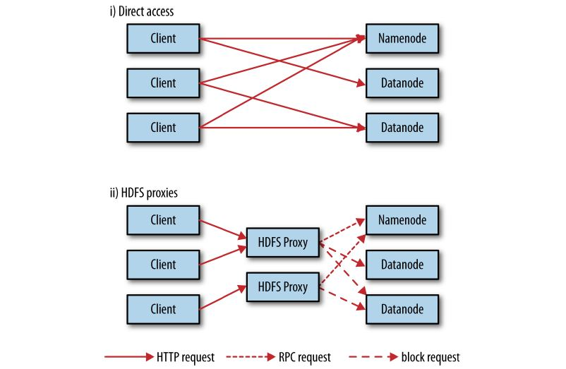

# HDFS

## HDFS的设计

HDFS以流式数据访问模式来存储超大文件，运行于商用硬件集群上。
1. **超大文件**  在这里指具有几百GB甚至几百TB大小的文件

1. **流式数据访问**  HDFS构建思路：一次写入、多次读取是最高效的访问模式。数据集通常由数据源生成或从数据源复制而来，接着长时间在此数据集上进行各种分析。每次分析都将涉及该数据集的大部分数据甚至全部，因此读取整个数据集的时间延迟比读取第一条记录的时间延迟更重要。

1. **商用硬件**  HDFS遇到故障时，被设计成能够继续运行且不让用户感觉到明显的中断

1. **低时间延迟的数据访问**  要求低时间延迟数据访问的应用，例如几十毫秒范围，不适合在HDFS上运行。HDFS是为高数据吞吐量应用优化的，可能会以提高时间延迟为代价。目前，对于低延迟的访问需求，HBase是更好的选择。

1. **大量的小文件**  由于namenode将文件系统的元数据存储在内存中，因此该文件系统所能存储的文件总数受限于namenode的内存容量。根据经验，每个文件、目录和数据块的存储信息大约占150字节。若有一百万个文件，且每个文件占一个数据块，至少需要300MB的内存。

1. **多用户写入，任意修改文件**  HDFS中的文件可能只有一个writer，而且写操作总是将数据添加在文件的末尾。它不支持具有多个写入者的操作，也不支持在文件的任意位置进行修改

## 数据块

文件系统块一般为几千字节，磁盘块一般为512字节。HDFS块（block）默认为**128MB**，与单一磁盘上的文件系统相似，HDFS上的文件也被划分为块大小的多个分块（clunk），作为独立的存储单元。但与其他文件系统不同的是，HDFS中小于一个块大小的文件不会占据整个块的空间。

HDFS的块比磁盘的块大，其目的是为了最小化寻址开销。如果块设置得足够大，从磁盘传输数据的时间会明显大于定位这个块开始位置所需的时间。因而，传输一个由多个块组成的文件的时间取决于磁盘传输速率。

若寻址时间约为10ms，而传输速率为100MB/s，为了使寻址时间仅占传输时间的1%，要将块大小 设置约为100MB。默认的块大小为128MB,但是很多情况下HDFS使用更大的块大小，随着新一代磁盘驱动器传输速率的提升，块的大小将被设置得更大。

HDFS的fsck命令可显示块信息
```
%hadoop fsck / -files -blocks
```

## namenode和datanode

HDFS集群有两类节点以管理者-工作者模式运行，即一个namenode（管理者）和多个datanode（工作者）。namenode管理文件系统的命名空间。它维护着文件系统树及整棵树内所有的文件和目录。这些信息以两个文件形式永久保存在本地磁盘上：命名空间镜像文件和编辑日志文件。namenode也记录着每个文件中各个块所在的数据节点信息，但它并不永久保存块的位置信息，因为这些信息会在系统启动时由数据节点重建。

客户端（client）代表用户通过与namenode和datanode交互来访问整个文件系统。客户端提供一个类似于POSIX（可移植操作系统界面）的文件系统接口，因此用户在编程时无需知道namenode和datanode也可实现其功能。

datanode是文件系统的工作节点。它们根据需要存储并检索数据块（受客户端或namenode调度），并且定期向namenode发送它们所存储的块的列表。没有namenode，文件系统将无法使用。




# 相关项目

## Avro

[Apache Avro](http://avro.apache.org/)是一个独立于编程语言的数据序列化系统，旨在解决Hadoop中Writable类型的不足：缺乏语言的可移植性。

## Hive

[Hive](http://hive.apache.org/)的设计目的是让精通SQL技能（但Java编程技能相对较弱）的分析师能够对Facebook存放在HDFS中的大规模数据集执行查询。目前，Hive已经是一个成功的Apache项目，很多组织把它用途一个通用的、可伸缩的数据处理平台。

## HBase

[HBase](http://hbase.apache.org/)是一个在HDFS上开发的面向列的分布式数据库，如果需要实时地随机访问超大规模数据集，就可以使用HBase

## Sqoop

[Sqoop](http://sqoop.apache.org/)允许用户将数据从结构化存储器抽取到Hadoop中，用于进一步的处理。抽取出的数据可以被MapReduce程序使用，也可以被其他类似于Hive的工具使用。（甚至可以使用Sqoop将数据从数据库转移到HBase）一旦生成最终的分析结果，Sqoop便可以将这些结果导回数据存储器，供其他客户端使用。
